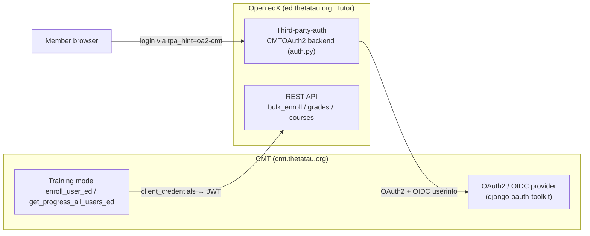

# Theta Tau — Open edX ↔ CMT connection (SSO + API)

This is the companion to [BRANDING.md](BRANDING.md). Branding was "the first step
in tightening the Open edX ↔ CMT integration"; **this** document covers the actual
connection: single sign-on (members log into Open edX with their CMT account) and
the REST API link CMT uses to **enroll** members and **sync training progress**.

> **Stack:** Tutor **v21** (Open edX *Ulmo*). Everything Open edX runs in Docker
> containers managed by Tutor. CMT is a Django app at `https://cmt.thetatau.org`;
> the Open edX site is at `https://ed.thetatau.org` (MFEs at
> `https://apps.ed.thetatau.org`).

---

## What these notes were for (summary)

The loose notes this document replaces were the working scratchpad for standing up
the connection. They cover four things:

1. **Deploying the SSO backend** — copying [auth.py](auth.py) (the `CMTOAuth2`
   social-auth backend) into the Tutor LMS/CMS settings and registering it in
   `AUTHENTICATION_BACKENDS`.
2. **Deploying the Tutor plugin** — copying [edx_plugin.py](edx_plugin.py) into the
   Tutor plugins directory (Mailjet email, hide registration, wire the OAuth
   backend + secret, enable the bulk-enroll view).
3. **Verifying the API credentials** — the `client_credentials` → JWT dance against
   `oauth2/access_token`, then calling `/api/courses/v1/courses` (this is exactly
   what CMT's `Training._ed_authenticate_header()` now does).
4. **Enrollment troubleshooting** — the dead ends (`can_enroll` never `True`,
   invitation-only, SHIB, wildcard `CourseEnrollmentAllowed`) that led to the
   working approach: the **staff `bulk_enroll` API with `auto_enroll`** (now
   implemented in CMT — see [Enrollment & progress](#5-enrollment--progress-sync)).

---

## Architecture



- **SSO (left→right):** Open edX is an OAuth2 **client** of CMT. A member clicks
  "log in", Open edX bounces to CMT, and on success provisions/updates the Open edX
  account (username = CMT `name`, email = CMT `email`). No Open edX self-registration.
- **API (bottom):** CMT is an OAuth2 **client** of Open edX. CMT exchanges the
  `ED_ID`/`ED_SECRET` for a JWT and calls staff-only APIs to enroll members and read
  grades.

### Files in this folder

| File | Role |
|------|------|
| [auth.py](auth.py) | `CMTOAuth2` social-auth backend (backend name **`cmt`**, PKCE). Deployed into the Tutor LMS/CMS settings as `lms.envs.tutor.auth`. |
| [edx_plugin.py](edx_plugin.py) | Tutor plugin: Mailjet email, hide registration, `AUTHENTICATION_BACKENDS`, `SOCIAL_AUTH_OAUTH_SECRETS['cmt']`, `ENABLE_BULK_ENROLLMENT_VIEW`. |

---

## 1. CMT side (the OAuth2 provider)

CMT already ships the OIDC provider (`OAUTH2_PROVIDER = {"OIDC_ENABLED": True, …}`
in [config/settings/base.py](../config/settings/base.py) with the custom claims in
[core/auth.py](../core/auth.py)). Two OAuth2 applications tie the systems together —
create both in CMT admin at **`/o/applications/`**:

### a) SSO application (Open edX logs in *as* the member)

| Field | Value |
|-------|-------|
| Client type | Confidential |
| Grant type | Authorization code (the backend uses **PKCE**) |
| Redirect URIs | `https://ed.thetatau.org/auth/complete/cmt/` |

The resulting **client id + secret** are configured on the Open edX side (the
third-party-auth provider **and** `SOCIAL_AUTH_OAUTH_SECRETS['cmt']` — see step 3).

`CMTOAuth2` in [auth.py](auth.py) points at these CMT endpoints (do not change
without updating both sides):

- authorize `…/o/authorize/`, token `…/o/token/`, userinfo `…/o/userinfo`
- The OIDC `name` claim (`core/auth.py`) becomes the Open edX **username**; `email`
  becomes the Open edX email.

### b) API application (CMT calls Open edX) — lives on the **Open edX** side

This one is registered in **Open edX** admin (step 4), not CMT. Its credentials are
stored in CMT's environment:

```bash
ED_ID=<open edx application client id>
ED_SECRET=<open edx application client secret>
ED_HOST=https://ed.thetatau.org                     # default
ED_COURSES=course-v1:ThetaTau+TT101+intro           # comma-separated for multiple
```

These map to [config/settings/base.py](../config/settings/base.py) (`ED_ID`,
`ED_SECRET`, `ED_HOST`, `ED_COURSES`).

> **CORS:** CMT already allows the Open edX origins via
> `CORS_ALLOWED_ORIGIN_REGEXES` (`^https://\w+\.thetatau\.org$` covers
> `ed.thetatau.org`; a second regex covers `studio.ed.thetatau.org`).

---

## 2. Deploy the SSO backend + plugin to Open edX

Everything Open edX-side is done in the Tutor virtualenv. Locate the two Tutor
directories with `tutor config printroot` (env/config) and `tutor plugins printroot`
(plugins).

### Local (Windows / PowerShell) — run from the repo root

```powershell
Set-Location C:\workspace\CMT
.\tutor\Scripts\Activate.ps1

# 1. Deploy the CMTOAuth2 backend into the LMS *and* CMS settings.
#    Dropped here it imports as lms.envs.tutor.auth.CMTOAuth2.
$root = tutor config printroot
Copy-Item .\OpenEdX\auth.py "$root\env\apps\openedx\settings\lms\" -Force
Copy-Item .\OpenEdX\auth.py "$root\env\apps\openedx\settings\cms\" -Force

# 2. Deploy the Tutor plugin.
$plugins = tutor plugins printroot
Copy-Item .\OpenEdX\edx_plugin.py $plugins -Force
tutor plugins disable edx_plugin   # no-op the first time
tutor plugins enable  edx_plugin

# 3. Apply and restart (dev image mounts settings, so no rebuild for auth.py).
tutor config save
tutor dev restart        # or: tutor local restart
```

### Production (Linux) — in the Tutor venv, from the repo checkout

```bash
source /path/to/tutor-venv/bin/activate
cd /path/to/CMT

ROOT="$(tutor config printroot)"
cp OpenEdX/auth.py "$ROOT/env/apps/openedx/settings/lms/"
cp OpenEdX/auth.py "$ROOT/env/apps/openedx/settings/cms/"

PLUGINS="$(tutor plugins printroot)"
cp OpenEdX/edx_plugin.py "$PLUGINS/"
tutor plugins disable edx_plugin
tutor plugins enable  edx_plugin

tutor config save
tutor local restart
```

> **Fill in the secrets** before (or right after) `tutor config save`. In
> [edx_plugin.py](edx_plugin.py) set the Mailjet keys (`MAILJET_API_KEY`,
> `MAILJET_SECRET_KEY`) and the SSO secret
> `SOCIAL_AUTH_OAUTH_SECRETS = {'cmt': '<client secret from step 1a>'}`. Keep real
> secrets out of git — set them in the plugin on the host, or via
> `tutor config save --set …`.

> **Re-copy `auth.py` if it disappears.** `auth.py` is a loose file in the rendered
> env, not a template, so if a future `tutor config save` regenerates the settings
> dir you may need to copy it again. (A cleaner future refactor is to inject the
> backend via the plugin's `ENV_PATCHES` so it survives re-renders.)

The plugin (`edx_plugin.py`) applies, among others:

- `AUTHENTICATION_BACKENDS = ['lms.envs.tutor.auth.CMTOAuth2', 'auth_backends.backends.EdXOAuth2', 'django.contrib.auth.backends.ModelBackend']`
- `SHOW_REGISTRATION_LINKS = False` (members must come through SSO)
- `FEATURES['ENABLE_BULK_ENROLLMENT_VIEW'] = True` (enables the enroll API CMT uses)
- Mailjet (`anymail`) as the email backend

---

## 3. Configure third-party-auth in Open edX admin

Once the backend is loaded, register the provider so the login button and
`tpa_hint` work. In Open edX admin → **`/admin/third_party_auth/oauth2providerconfig/`**:

| Field | Value |
|-------|-------|
| Enabled | ✅ |
| Backend name | `cmt` |
| Client ID (key) | CMT SSO application client id (step 1a) |
| Client Secret | CMT SSO application client secret |

The provider id becomes **`oa2-cmt`** (that's the `tpa_hint` value used in the login
URLs below). Match the secret in `SOCIAL_AUTH_OAUTH_SECRETS['cmt']`.

---

## 4. Register the API application in Open edX admin

This is the credential CMT uses for `bulk_enroll` and grades. In Open edX admin →
**`/admin/oauth2_provider/application/`** → *Add application*:

| Field | Value |
|-------|-------|
| Client type | Confidential |
| Authorization grant type | **Client credentials** |
| User (owner) | **A global-staff user** (`is_staff=True`) |

> **The owner MUST be global staff.** `bulk_enroll` and the grades API use
> `IsStaff`/`JWT_RESTRICTED_APPLICATION_OR_USER_ACCESS`; a non-staff owner gets
> **403**. Create/verify one, e.g.:
> ```bash
> tutor local run lms ./manage.py lms manage_user --superuser api.bot@thetatau.org api.bot@thetatau.org
> # or grant staff to an existing user, then set that user as the application owner
> ```

Copy the generated **client id → `ED_ID`** and **client secret → `ED_SECRET`** into
CMT's environment.

---

## 5. Enrollment & progress sync

### The problem the notes were chasing

The scratch notes tried to make members self-enroll by tweaking the course
(`can_enroll`, invitation-only, SHIB-based enrollment, and a wildcard
`CourseEnrollmentAllowed`). None of it made `can_enroll` return `True`, because the
courseware enroll view intentionally gates self-enrollment.

### The working approach (implemented in CMT)

Don't fight the self-enroll gate — enroll **as staff** through the API:

- **Enroll:** `POST {ED_HOST}/api/bulk_enroll/v1/bulk_enroll` with
  `auto_enroll=true`. If the member already has an Open edX account they are enrolled
  immediately; if not, a pending `CourseEnrollmentAllowed` is created that becomes a
  real enrollment the first time they log in via SSO. Requires
  `ENABLE_BULK_ENROLLMENT_VIEW=True` (set by the plugin) and the global-staff API
  account (step 4). Implemented as `Training.enroll_user_ed()` and called from the
  pledge form, the national-officer role change, the admin action, and the
  `enroll_all_ed` management command.
- **SSO + enroll in one hop (deep link):** send a member to
  ```
  https://ed.thetatau.org/account/finish_auth?course_id=course-v1:ThetaTau+TT101+intro&enrollment_action=enroll&course_mode=honor&email_opt_in=false&tpa_hint=oa2-cmt
  ```
  which logs them in through CMT and enrolls them in one redirect.
- **Progress sync (edX → CMT):** `Training.get_progress_all_users_ed()` pages the
  grades API `GET {ED_HOST}/api/grades/v1/courses/{course_id}/` and upserts a
  `Training` row per member. Triggered by `python manage.py sync_trainings`.

See [../thetatauCMT/trainings/models.py](../thetatauCMT/trainings/models.py) for all
of the above.

---

## 6. Test the connection

### SSO

```
# Force the CMT login on the MFE login page:
https://apps.ed.thetatau.org/authn/login?tpa_hint=oa2-cmt
```

A member should be bounced to CMT, approve, and land logged into Open edX with their
CMT name/email.

### API credentials (mirrors `Training._ed_authenticate_header`)

```python
import base64, requests

credential = f"{client_id}:{client_secret}"                     # ED_ID:ED_SECRET
encoded = base64.b64encode(credential.encode()).decode()
token = requests.post(
    "https://ed.thetatau.org/oauth2/access_token",
    headers={"Authorization": f"Basic {encoded}", "Cache-Control": "no-cache"},
    data={"grant_type": "client_credentials", "token_type": "jwt"},
).json()["access_token"]

# Should return the course list (200):
requests.get(
    "https://ed.thetatau.org/api/courses/v1/courses",
    headers={"Authorization": f"JWT {token}"},
)
```

The Open edX SDK equivalents also work if you prefer them:
`edx_rest_api_client.client.OAuthAPIClient` or
`openedx_rest_api_client.client.OpenedxRESTAPIClient(host, client_id, client_secret)`.

Reference: bulk-enroll endpoint —
<https://docs.openedx.org/projects/edx-platform/en/latest/references/lms_apis.html#post--bulk_enroll-v1-bulk_enroll>

---

## 7. Operations cheat-sheet

Collected from the deployment notes.

**Tutor config / env locations**

```bash
tutor config printroot                                   # env + config.yml root
cat "$(tutor config printroot)/config.yml"
# rendered per-service env:
#   $(tutor config printroot)/env/apps/openedx/config/lms.env.yml
#   $(tutor config printroot)/env/apps/openedx/config/cms.env.yml
```

**Restore a Tutor backup** (careful — overwrites the config root):

```bash
sudo rsync -avr /tmp/tutor-backup/ "$(tutor config printroot)"/
```

**User management**

```bash
# Reset a password:
tutor local run lms ./manage.py lms changepassword frank.ventura@thetatau.org

# Create a staff+superuser (dev):
tutor dev do createuser --staff --superuser test@thetatau.org test@thetatau.org

# Remove a user:
tutor local run lms ./manage.py lms manage_user --remove <username> <email>
```

**Send a test email through the Mailjet backend**

```bash
tutor local run --no-deps lms ./manage.py lms shell -c \
  "from django.core.mail import send_mail; send_mail('test subject', 'test message', 'cmt@thetatau.org', ['you@example.com'])"
```

**Local dev MFE URLs** (Tutor dev, `local.edly.io`)

```
LMS        http://local.edly.io:8000        Studio      http://studio.local.edly.io:8001
authn      http://apps.local.edly.io:1999   account     http://apps.local.edly.io:1997
learning   http://apps.local.edly.io:2000   dashboard   http://apps.local.edly.io:1996
```

> **Local-only:** if Open edX (in Docker) must reach CMT running on the host, add
> `ALLOWED_HOSTS.append('host.docker.internal')` (present, commented, in
> [edx_plugin.py](edx_plugin.py)).

**Tutor plugin / patch references**

- Patch catalog — <https://docs.tutor.edly.io/reference/patches.html>
- `CONFIG_DEFAULTS` / hooks — <https://docs.tutor.edly.io/reference/api/hooks/catalog.html>
